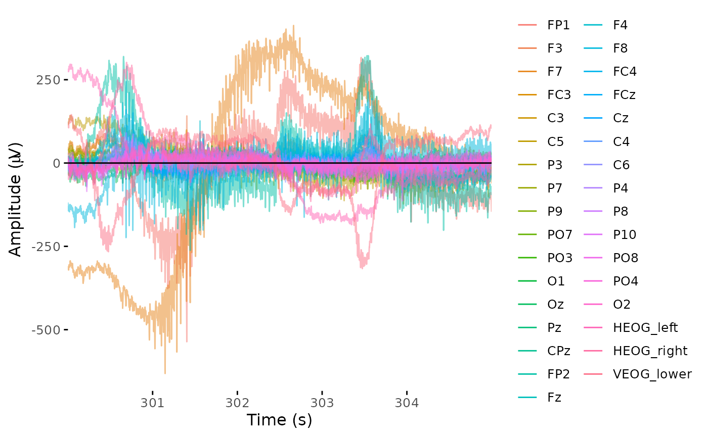

These are my notes and completed exercises taken from [this 2022 seminar on EEG data analysis in R](https://alexenge.github.io/eegSeminaR/). 

## Setting Up Data

Though they use the data at `alexenge/erpcore`, we will use the data from `eegverse/erpcore`, as the former does not seem to exist anymore on GitHub.

```{r}
#| label: install-erpcore
#| output: false

pak::pak("eegverse/erpcore")

library(erpcore)
library(here)    # For general handling of local data files
```

Moreover, we will only be using data from the N170 experiment, which showed that subjects who were hooked up to EEGs and were tasked with viewing faces elicited different responses than when they were tasked to view cars.

```{r}
#| label: get-n170
#| eval: false

data_dir <- here("eegs", "data/n170") # for me, all of my files are in ./eegs/ 
dir.create(data_dir, recursive = TRUE)

# This function downloads all n170 data to `data_dir`
get_erpcore(
  component = "n170",
  dest_path = data_dir,
  type = "bids",          # we only want data in BIDS format
  subjects = "sub-001",   # limit our subjects  to just 001 for now
  conflicts = "overwrite"
)
```

## Preprocessing

For preprocessing, we first load `eegUtils`, a package for working with EEG data.

```{r}
#| label: load-eegUtils
#| output: false

pak::pak("craddm/eegUtils")

library(eegUtils)
```

The downloaded ERP CORE data is in `data/n170`, as we specified in the setup section.
The data is in BIDS format; though the seminar notes say the subjects are each in their respective `sub-XXX/egg` directory, on my end the file structure looks like `{subject-number}/{subject-number}_N170.set`.

So, we retrieve this `.set` file for subject 1:

```{r}
#| label: set-file

bids_dir <- here("eegs", "data/n170")
set_file <- here(bids_dir, "1/1_N170.set")
file.exists(set_file)
```
`eegUtils` has functions for importing raw EEG data from various file formats into R, including the `.set` format used by ERP CORE.

```{r}
#| label: import-set-deps
#| output: false

# Needed these packages for `import_set` to work
pak::pak("R.matlab", "hdf5r") 
```

```{r}
#| label: data-raw

dat_raw <- import_set(set_file)
```

Inspecting the data type:
```{r}
#| label: inspect-data-type

class(dat_raw)
```

we see `eeg_data` is a custom class defined by `eegUtils` — a big list with many sub-components:

```{r}
#| label: inspect-dat-raw

str(dat_raw)
```

The data we actually care about is in the `dat_raw$signals` data frame.
Here, each row is one sample (time point), each column is one channel (EEG electrode), and each value is the EEG voltage (in microvolts; µV) measured at this time sample and channel.

### Viewing Data

We can visually check the data at multiple steps using the `browse_data` function. 
This will open a site we can open either on our browser or in the "Viewer" tab on the right-hand side of RStudio from which we can interactively inspect the data.
We can use the function as is by calling `browse_data` on our `dat_raw`, i.e. `browse_data(dat_raw)`, or we can manually specify which time steps we want to see as follows:

```{r}
#| label: browse-data
#| eval: false
#| output: false

time_lim <- c(300, 305)
browse_data(dat_raw, time_lim, baseline = time_lim)
```

Note that unlike in the seminar example, the interactive example does not give a legend showing which colors indicate which channel.
Below is the example image given in the seminar:



### Channel Locations

For some steps, such as with making topographic plots, we need to know the relative positions of electrodes on the scalp. 
These are sometimes included in the raw data, but in this case we need to use a separate function:

```{r}
#| label: electrode-locations

dat_raw <- electrode_locations(dat_raw, montage = "biosemi64", overwrite = TRUE)
dat_raw$chan_info

plot_electrodes(dat_raw, interact = TRUE)
```
